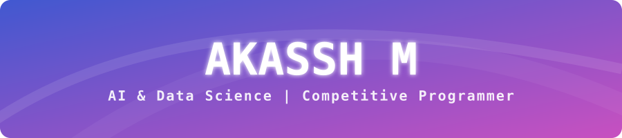

<!-- HERO BANNER -->

  

<!-- TYPEWRITER -->

  

 

<!-- ASCII + INFO TERMINAL -->

  <table>
    <tr>
      <td align="center" width="45%" valign="top">
        
      </td>
      <td align="center" width="55%" valign="top">
        
      </td>
    </tr>
  </table>

 

<!-- CONTRIBUTION SNAKE -->

  <picture>
    <source media="(prefers-color-scheme: dark)" srcset="https://raw.githubusercontent.com/AKASSH-M/AKASSH-M/output/dist/github-contribution-grid-snake-dark.svg" />
    <source media="(prefers-color-scheme: light)" srcset="https://raw.githubusercontent.com/AKASSH-M/AKASSH-M/output/dist/github-contribution-grid-snake.svg" />
    
  </picture>

---

<!-- ABOUT ME -->
##  About Me

I'm a B.Tech student at **Chennai Institute of Technology**, pursuing **Artificial Intelligence & Data Science**, passionate about problem-solving, intelligent systems, and building meaningful technology.

As a **LeetCode Guardian**, competitive programming has strengthened my analytical thinking and problem-solving skills. Beyond DSA, I'm exploring **AI/ML, software engineering, and web technologies**, building projects that connect these areas to real-world problems.

I believe in **learning by building, staying adaptable, and growing through challenges** — always looking for opportunities to learn, collaborate, and create.

---

<!-- PROJECTS -->
##  Projects

### Data Processing and Analysis System — MOSPI
A deterministic data-processing pipeline designed for the Ministry of Statistics and Programme Implementation (MoSPI) to transform raw survey data into compliant, structured datasets and reports.

*Focus: Data Processing • Statistical Pipelines • Data Validation • Auditability*

---

### Agentix
An AI agent network built with LangGraph for intelligent hospital and healthcare administration, enabling specialized agents to monitor, predict, decide, govern, and automate operational tasks.

*Focus: AI Agents • LangGraph • LLMs • Agent Communication*

---

### Plant Disease Detection System
A CNN-based computer vision system for detecting and classifying plant diseases from leaf images, integrated with a web interface for real-time predictions.

*Focus: Computer Vision • CNN • Deep Learning • Real-Time Prediction*

  

---

<!-- MY STUFF -->
##  My Stuff

  <table>
    <tr>
      <td align="center" width="50%" valign="top">
        
      </td>
      <td align="center" width="50%" valign="top">
        
      </td>
    </tr>
  </table>

---

<!-- CONNECT WITH ME -->
##  Connect With Me

